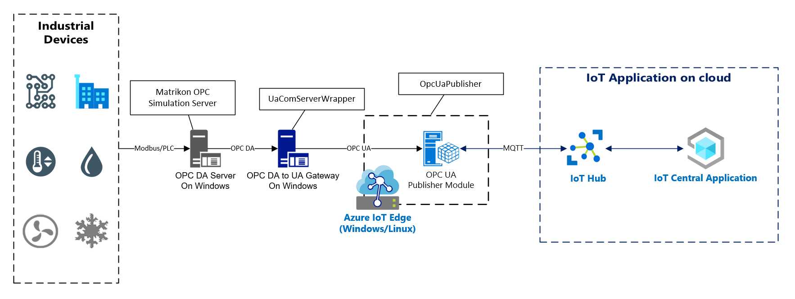
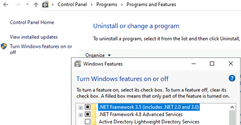
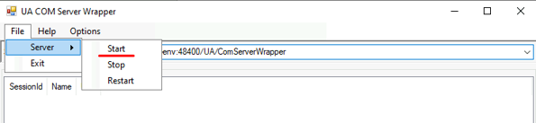

# End to end IIoT data ingestion solution.

OPC DA is one of the [OPC Classic specifications](https://opcfoundation.org/about/opc-technologies/opc-classic/) based on Microsoft Windows COM/DCOM(Distributed Component Object Model) technology, and still widely used by traditional industrial company in their industrial system like SCADA or BMS.  

This end to end iiot data ingestion PoC solution is then implemented, to demostrate collecting data from legacy OPC DA server, puslish it in modern OPC UA server and send to cloud.

Here is the solution architecture:  

In this architecture:

1. Device or sensor data collected via field protocols(PLC, Modbus etc.) is stored and published in the OPC DA server running on Windows. In this implementation, we use the [Matrikon OPC Simulation Application](tools/MatrikonOPCSimulation.zip) to act as a OPC DA server.  

2. The OPC DA to UA Gateway application subscribes data in the OPC DA Server and publish it in its embedded OPC UA Server. In this implementation, the [UaComServerWrapper](src/UaComServerWrapper/) application act as this gateway, running on Windows as COM/DCOM is only supported on Windows.

3. The [OPC UA Publisher](src/OpcUaPublisher/) module running on Azure IoT Edge subscribes data published in the OPC DA/UA gateway and send it to Azure IoT Hub or IoT Central in the cloud.  

This solution architecture provides the ability to keep customer existing system's compatibility while leveraging modern IoT technologies. It can deploy all components in a single machine, or to seperate server machines, the deployment mode can refer to below diagram.

  

if the OPC DA server and UaComServerWrapper application are deployed into seperate servers, you need to follow [this guide](docs/dcom-configuration-on-windows.md) to setup the DCOM configuration on Windows to enable the DCOM communication between them.

## Quick Start

The most easy to get started is install all components in one single dev machine, in this guide we use Windows 10.

### Setup OPC DA Server
For development purpose, we use the Matrikon OPC Simulation server to simulate a OPC DA server.

1. Enable .NET Framework 3.5 feature on Windows  

    

2. Install Matrikon OPC Simulation server

    Extract [MatrikonOPCSimulation.zip](tools/MatrikonOPCSimulation.zip) and double click to start the installation. Note down information in below pictures if you need to setup DCOM.

    Select "Customized Setup".   
    

    Ensure "Automatically configure DCOM settings" is checked.  
    
    
    Set the server password.  
    

    Now you can use the `MatrikonOPC Explorer` application to connect this OPC DA server.  
    

### Setup OPC DA to UA Gateway application(UaComServerWrapper)

1. Install .NET Framework 4.6.1 or above  
2. Install UaComServerWrapper
    Use the [UaComServerWrapperInstaller](pre-builds/UAComServerWrapper/UAComServerWrapperInstaller.msi) to start installation.
3. Configure the OPC UA server inside UaComServerWrapper  

    Set the OPC DA Server Url to which it connects, it's `opc.com://localhost/Matrikon.OPC.Simulation.1` in this guide.
    
    

    Set the user name and password for the OPC UA server inside UaComServerWrapper, it will use this user name and password to authenticate the client connect to it.  
    
        

    Start the UA server, and it's URL would be `opc.tcp://<your machine ip>:48400/UA/ComServerWrapper`  
      

    Now you can use OPC UA client tool like [UaExpert](tools/uaexpert-bin-win32-x86-vs2008sp1-v1.5.1-331.zip) to connect to this server and explore the data it reads from the OPC DA server.   
      

### Run OPC UA Publisher  
Follow this [guide](src/OpcUaPublisher/README.md) to run the OpcUaPublisher application to subscribe and send data from the OPC UA server inside UaComServerWrapper to Azure IoT Hub or IoT Central on cloud.

## Development from source code

Follow this [guide](docs/dev-guide.md) to build and run from source code.
