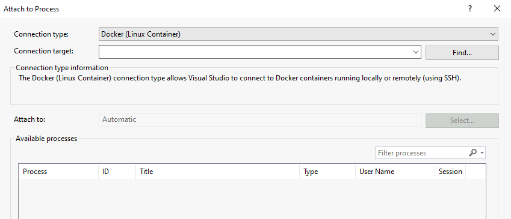
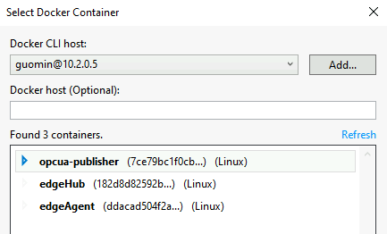
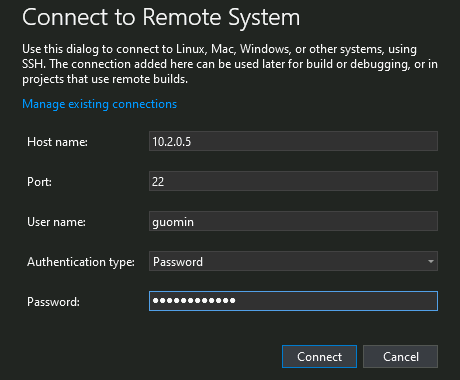
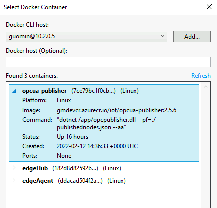
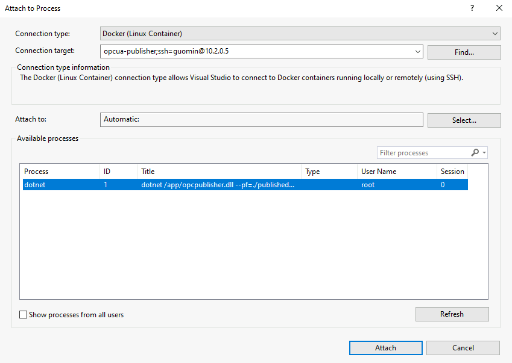

# Source code development guide

Coming soon...

## Remote debug OpcUaPublisher container running in Azure IoT Edge
1. Use the [Dockerfile.linux-amd64.debug](./../src/OpcUaPublisher/Docker/Dockerfile.linux-amd64.debug) to build a docker image with debug info
2. Deploy the docker image with `--wfd` command line parameter in the `Container Create Options`, sample as below: 
    ```json
    {
        "Hostname": "opcua-publisher",
        "Cmd": [
            "--pf=./publishednodes.json",
            "--aa",
            "--wfd"
        ],
        "HostConfig": {
            "Binds": [
                "/opt/opcua-publisher:/appdata"
            ]
        }
    }
    ``` 
    then the container will start and wait for a debugger attach to it.
3. In Visual Studio, remotely attach the opcpublisher process in container to start debug  
    Select `Debug` -> `Attach to Process` to open the "Attach to Process" dialog.
      
    For "Connection type", select "Docker(Linux Container)", click the "Find..." button to open "Select Docker Container" dialog.    
        
    Click the "Add..." button to add a Docker CLI host with SSH access, this host is the IoT Edge device.  
     

    Click "Connect" and select container running OpcUaPublisher to start debug.   
     
    

## Notes:
1. Start UA COM Server Wrapper directly, it will create certificates automatically and put in the %CommonApplicationData%\OPC Foundation\pki folder, also save username and password in %CommonApplicationData%\OPC Foundation\Accounts

2. For OpcUaPublisher, in VS debug settings, set working directory and command line parameters to start debug.
3. OpcUaPublisher will also create cetificates under pki folder in the working folder automatically if no cetificates provided
